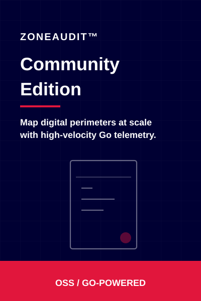
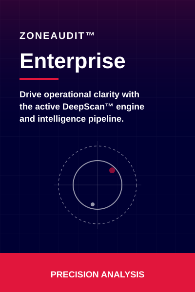
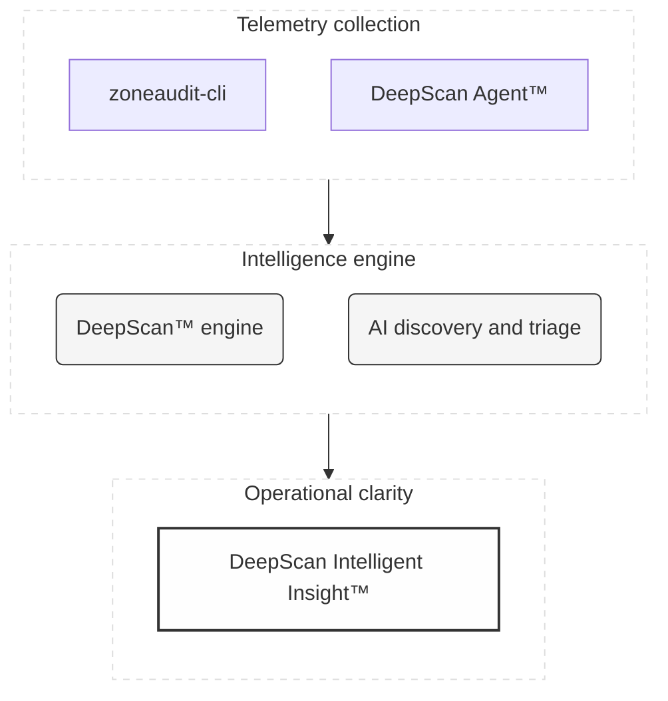

# ZoneAudit™

**Global attack surface management and actionable domain intelligence.**

ZoneAudit™ provides high-velocity telemetry collection and engineering-led analysis to maintain a continuous, validated map of your digital perimeter. The ecosystem is designed to bridge the gap between raw network data and operational clarity.

---

### Ecosystem and core projects

<table>
  <tr>
    <td width="45%" valign="top">
       
       
      <b>ZoneAudit™ Community Edition</b> 
      Tactical discovery of core digital perimeters with high-velocity Go telemetry. 
       
      <a href="https://github.com/ZoneAudit/zoneaudit-cli"><b>Explore the CLI →</b></a>
    </td>
    <td width="10%"></td>
    <td width="45%" valign="top">
       
       
      <b>ZoneAudit™ Enterprise</b> 
      Drive operational clarity with the active DeepScan™ engine and intelligence pipeline. 
       
      <a href="https://zoneaudit.com"><b>Join the waitlist →</b></a>
    </td>
  </tr>
</table>

---

### Data to insight flow

---

### Open source and community

ZoneAudit™ is built on a foundation of open telemetry. We believe that mapping the digital perimeter should be accessible, high-velocity, and community-driven.

- **Contribute**: We welcome pull requests for the [zoneaudit-cli](https://github.com/ZoneAudit/zoneaudit-cli), especially for new heuristics and scanning optimisations.
- **Heuristics**: Help us engineer new ways to spot orphaned infrastructure and misconfigured records.
- **Feedback**: Open an issue to discuss architectural improvements or feature requests.

---

### Connect with us

- **Website**: [zoneaudit.com](https://zoneaudit.com)
- **LinkedIn**: [ZoneAudit on LinkedIn](https://www.linkedin.com/company/zoneaudit)
- **Engineering**: A [CobraSphere](https://github.com/CobraSphere) technical excellence initiative.

---

_Built with precision in the United Kingdom._
